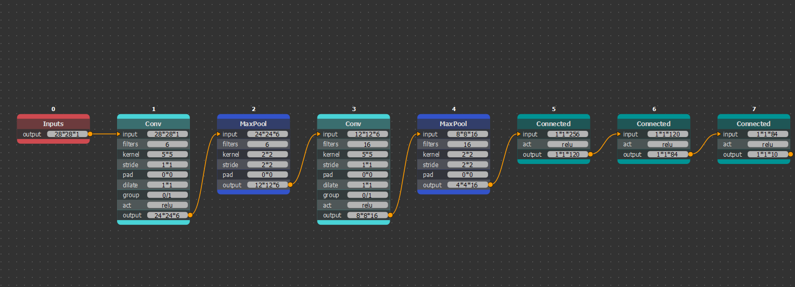
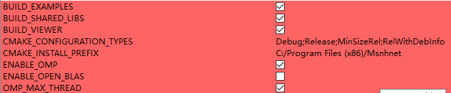
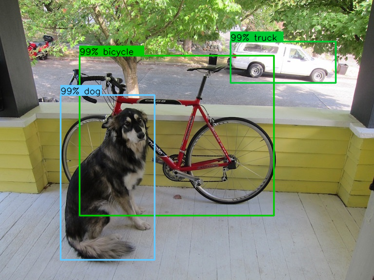
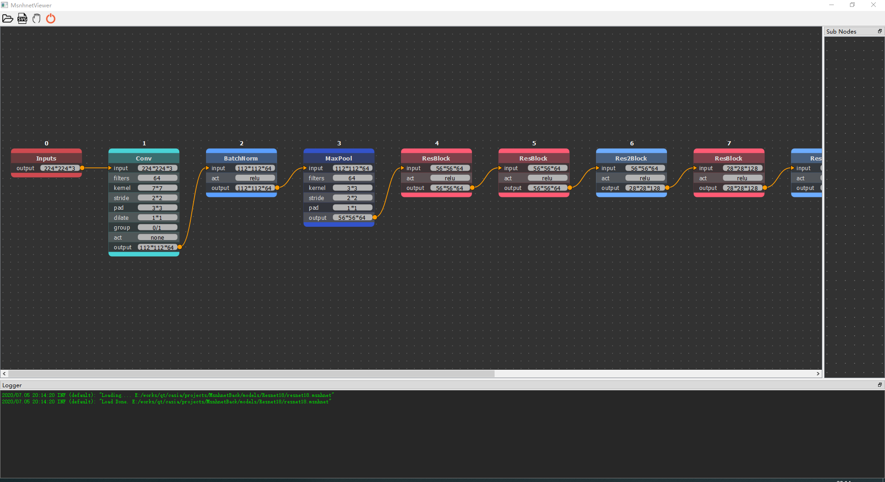
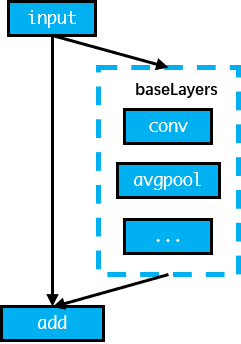
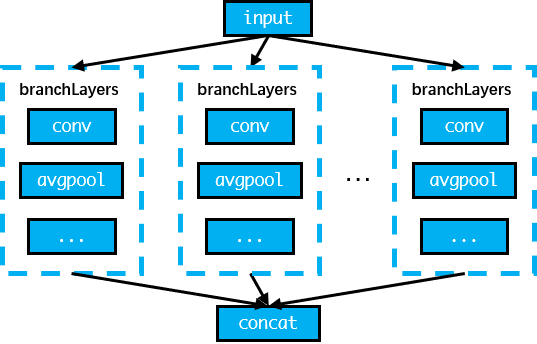

# Msnhnet

###  A mini pytorch inference framework which inspired from darknet.


**TODO:**</br>
1.GPU</br>
2.neon</br>

**OS supported** (you can check other OS by yourself)

| |windows|linux|mac|
|---|---|---|---|
|checked|<center>√</center>|<center>√</center>|<center>x</center>|
|gpu|<center>x</center>|<center>x</center>|<center>x</center>|

**Yolo Test** (Win10 MSVC 2017 I7-10700F)

|net|time|
|---|---|
|yolov3|465ms|
|yolov3_tiny|75ms|
|yolov4|600ms|

**Tested networks**
- lenet5
- lenet5_bn
- alexnet
- vgg16
- vgg16_bn
- resnet18
- resnet34
- resnet50
- resnet101
- resnet152
- darknet53
- googLenet
- yolov3
- yolov3_spp
- yolov3_tiny
- yolov4
- **pretrained models** 链接：https://pan.baidu.com/s/1WElMhBhaN5EnPJnD8S1P3w 
提取码：1hlm

**Requirements**
  * OpenCV4 https://github.com/opencv/opencv
  * yaml-cpp https://github.com/jbeder/yaml-cpp
  * Qt5 (**optional**. for Msnhnet viewer) http://download.qt.io/archive/qt/

**How to build**
- With CMake 3.10+
- Options</br>
</br>
**ps. You can change omp threads by unchecking OMP_MAX_THREAD and modifying "num" val at CMakeLists.txt:43** </br>

- Windows
1. Compile opencv4 and yaml-cpp.
2. Config environment. Add "OpenCV_DIR" and "yaml-cpp_DIR" 
3. Get qt5 and install. http://download.qt.io/ **(optional)**
4. Then use cmake-gui tool and visual studio to make or use vcpkg.

- Linux(Ubuntu)
```
sudo apt-get install qt5-default      #optional
sudo apt-get install libqt5svg5-dev   #optional
sudo apt-get install libopencv-dev

# build yaml-cpp
git clone https://github.com/jbeder/yaml-cpp.git
cd yaml-cpp
mdir build 
cd build 
cmake ..
make -j4
sudo make install 

#config 
sudo echo /usr/local/lib > /etc/ld.so.conf/usrlib.conf
sudo ldconfig

# build Msnhnet
git clone https://github.com/msnh2012/Msnhnet.git

cd Msnhnet/build
cmake -DCMAKE_BUILD_TYPE=Release ..  
make -j4
sudo make install

vim ~/.bashrc # Last line add: export PATH=/usr/local/bin:$PATH

```
**Test Msnhnet**
- 1. Download pretrained model and extract. eg.D:/models. 
- 2. Open terminal and cd "Msnhnet install bin". eg. D:/Msnhnet/bin
- 3. Test yolov3 "yolov3 D:/models".
- 4. Test yolov3tiny_video "yolov3tiny_video D:/models".
- 5. Test classify "classify D:/models".</br>

</br>

**View Msnhnet**
- 1. Open terminal and cd "Msnhnet install bin" eg. D:/Msnhnet/bin
- 2. run "MsnhnetViewer"

</br>

**PS. You can double click "ResBlock Res2Block AddBlock ConcatBlock"  node to view more detail**</br>
**ResBlock**</br>
</br>

**Res2Block**</br>
</br>

**AddBlock**</br>
</br>

**ConcatBlock**</br>
</br>

**How to convert your own pytorch network**
1. Use pytorch to load network
```
import torchvision.models as models
import torch
from torchsummary import summary 

md = models.resnet18(pretrained = True)
md.to("cpu")
md.eval()

print(md, file = open("net.txt", "a"))

summary(md, (3, 224, 224),device='cpu')
```
2. Write msnhnet file according to net.txt and summary result.(Manually :o. Like darnet cfg)
3. Export msnhbin 
```
val = []
dd = 0
for name in md.state_dict():
        if "num_batches_tracked" not in name:
                c = md.state_dict()[name].data.flatten().numpy().tolist()
                dd = dd + len(c)
                print(name, ":", len(c))
                val.extend(c)

with open("alexnet.msnhbin","wb") as f:
    for i in val :
        f.write(pack('f',i))
```
**Ps. More detail in file "pytorch2msnhbin/pytorch2msnhbin.py"**

Enjoy it! :D
