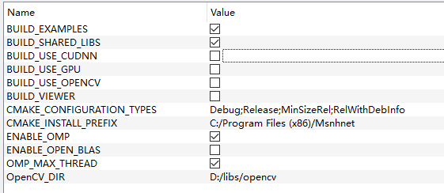

# 🔥 Msnhnet(V2.0 Focusing on Robot Vision)🔥
English| [中文](ReadMe_CN.md) |[CSDN](https://blog.csdn.net/MSNH2012/article/details/107216704)</br>
###  A mini pytorch inference framework which inspired from darknet.


</br>
</br>
**OS supported** (you can check other OS by yourself)

| |windows|linux|mac|loongson|
|:---:|:---:|:---:|:---:|:--:|
|checked|||||
|gpu|||||

**CPU checked**
| |Intel i7|raspberry 3B|raspberry 4B|Jeston NX|
|:---:|:---:|:---:|:---:|:---:|
|checked|||||

**Features**

- C++ Only. 3rdparty blas lib is optional, also you can use OpenBlas.
- OS supported: Windows, Linux(Ubuntu checked) and Mac os(unchecked).
- CPU supported: Intel X86, AMD(unchecked) and ARM(checked: armv7 armv8 arrch64).
- x86 avx2 supported.(Working....)
- arm neon supported.(Working....)
- A cv lib like opencv is supported for msnhnet.(MsnhCV) 
- conv2d 3x3s1 3x3s2 winograd3x3s1 is supported(**Arm**)
- Keras to Msnhnet is supported. (Keras 2 and tensorflow 1.x)
- GPU cuda supported.(Checked GTX1080Ti, Jetson NX)
- GPU cudnn supported.(Checked GTX1080Ti, Jetson NX)
- GPU fp16 mode supported.(Checked GTX1080Ti, Jetson NX.)
- **ps. Please check your card wheather fp16 full speed is supported.**
- c_api supported.
- keras 2 msnhnet supported.(Keras 2 and tensorflow 1.x, part of op)
- pytorch 2 msnhnet supported.(Part of op, working on it)
- [MsnhnetSharp](https://github.com/msnh2012/MsnhnetSharp) supported.

- A viewer for msnhnet is supported.(netron like)

- Working on it...(**Weekend Only  (╮（╯＿╰）╭)**)

**Tested networks**
- lenet5
- lenet5_bn
- alexnet(**torchvision**)
- vgg16(**torchvision**)
- vgg16_bn(**torchvision**)
- resnet18(**torchvision**)
- resnet34(**torchvision**)
- resnet50(**torchvision**)
- resnet101(**torchvision**)
- resnet152(**torchvision**)
- darknet53[(Pytorch_Darknet53)](https://github.com/developer0hye/PyTorch-Darknet53)
- googLenet(**torchvision**)
- mobilenetv2(**torchvision**)
- yolov3[(u版yolov3)](https://github.com/ultralytics/yolov3)
- yolov3_spp[(u版yolov3)](https://github.com/ultralytics/yolov3)
- yolov3_tiny[(u版yolov3)](https://github.com/ultralytics/yolov3)
- yolov4[(u版yolov3)](https://github.com/ultralytics/yolov3)
- fcns[(pytorch-FCN-easiest-demo)](https://github.com/bat67/pytorch-FCN-easiest-demo)
- unet[(bbuf keras)](https://github.com/BBuf/Keras-Semantic-Segmentation)
- deeplabv3(**torchvision**)
- yolov5s🔥[(U版yolov5, for params)](https://github.com/msnh2012/Yolov5ForMsnhnet)
- yolov5m🔥[(U版yolov5,for params)](https://github.com/msnh2012/Yolov5ForMsnhnet)</br>
==============================================================
- mobilenetv2_yolov3_lite (cudnn does not work with GTX10** Pascal Card, please use GPU model only)
- mobilenetv2_yolov3_nano (cudnn does not work with GTX10** Pascal Card, please use GPU model only)
- yoloface100k (cudnn does not work with GTX10** Pascal Card, please use GPU model only)
- yoloface500k (cudnn does not work with GTX10** Pascal Card, please use GPU model only)
- Thanks: https://github.com/dog-qiuqiu/MobileNetv2-YOLOV3
==============================================================
- **pretrained models**. 链接：https://pan.baidu.com/s/1mBaJvGx7tp2ZsLKzT5ifOg 
提取码：x53z 
- **pretrained models**. Link : [Google Drive](https://drive.google.com/drive/folders/1tgTvA80rUnMqKVhB3Rb8sIGvKS98ARG3?usp=sharing)
- Examples [here](https://github.com/msnh2012/Msnhnet/tree/master/examples).

**Yolo Test** 
- Win10 MSVC 2017 I7-10700F

  |net|yolov3|yolov3_tiny|yolov4|
  |:---:|:---:|:---:|:---:|
  |time|380ms|50ms|432ms|


- ARM(Yolov3Tiny cpu)
  |cpu|raspberry 3B|raspberry 4B|Jeston NX|
  |:---:|:---:|:---:|:---:|
  |with neon asm|?|0.432s|?|

**Yolo GPU Test**
- Ubuntu16.04  GCC  Cuda10.1  GTX1080Ti
  |net|yolov3|yolov3_tiny|yolov4|
  |:---:|:---:|:---:|:---:|
  |time|30ms|8ms|30ms|
  
- Jetson NX
  |net|yolov3|yolov3_tiny|yolov4|
  |:---:|:---:|:---:|:---:|
  |time|200ms|20ms|210ms|
  
**Yolo GPU cuDnn FP16 Test**
- Jetson NX
  |net|yolov3|yolov4|
  |:---:|:---:|:---:|
  |time|115ms|120ms|

**Yolov5s GPU Test**
- Ubuntu18.04  GCC  Cuda10.1  GTX2080Ti
  |net|yolov5s| yolov5s_fp16|
  |:---:|:---:|:---:|
  |time|9.57ms| 8.57ms|

**Mobilenet Yolo GPU cuDnn Test**
- Jetson NX
  |net|yoloface100k|yoloface500k|mobilenetv2_yolov3_nano|mobilenetv2_yolov3_lite|
  |:---:|:---:|:---:|:---:|:---:|
  |time|7ms|20ms|20ms|30ms|

**DeepLabv3 GPU Test**
- Ubuntu18.04  GCC  Cuda10.1  GTX2080Ti
  |net|deeplabv3_resnet101|deeplabv3_resnet50|
  |:---:|:---:|:---:|
  |time|22.51ms|16.46ms|
  
**Requirements**
  * OpenCV4 (**optional**) https://github.com/opencv/opencv
  * Qt5 (**optional**. for Msnhnet viewer) http://download.qt.io/archive/qt/
  * opengl(**optional**. for MsnhCV GUI) .
  * glew(**optional**. for MsnhCV GUI) http://glew.sourceforge.net/ .
  * glfw3(**optional**. for MsnhCV GUI) https://www.glfw.org/.
  * cuda10+ cudnn 7.0+.(**optional**. for GPU)

**Video tutorials(bilibili)**
- [Build on Linux](https://www.bilibili.com/video/BV1ai4y1g7Nf)
- [Build on Windows](https://www.bilibili.com/video/BV1DD4y127VB)
- [Pytorch Params to msnhbin](https://www.bilibili.com/video/BV1rh41197L8)

**How to build**
- With CMake 3.15+
- Viewer can not build with GPU.
- Options</br>
</br>
**ps. You can change omp threads by unchecking OMP_MAX_THREAD and modifying "num" val at CMakeLists.txt:52** </br>

- Windows
1. Compile opencv4 **(optional)**
2. Config environment. Add "OpenCV_DIR" **(optional)**
3. Get qt5 and install. http://download.qt.io/ **(optional)**
4. Add qt5 bin path to environment **(optional)**.
5. Get glew for MsnhCV Gui.http://glew.sourceforge.net/ **(optional)**.
6. Get glfw3 for MsnhCV Gui.https://www.glfw.org/ **(optional)**.
7. Extract glew, add glew path to "CMAKE_PREFIX_PATH" **(optional)**.
8. Compile gflw3 with cmake, add gflw3 cmake dir to "GLFW_DIR"  **(optional)**.
9. Then use cmake-gui tool and visual studio to make or use vcpkg.

- Linux(Ubuntu)

ps. If you want to build with Jetson, please uncheck NNPACK, OPENBLAS, NEON.

```

sudo apt-get install build-essential
sudo apt-get install qt5-default      #optional
sudo apt-get install libqt5svg5-dev   #optional
sudo apt-get install libopencv-dev    #optional
sudo apt-get install libgl1-mesa-dev libglfw3-dev libglfw3 libglew-dev #optional


#config 
sudo echo /usr/local/lib > /etc/ld.so.conf.d/usrlib.conf
sudo ldconfig

# build Msnhnet
git clone https://github.com/msnh2012/Msnhnet.git
mkdir build 

cd Msnhnet/build
cmake -DCMAKE_BUILD_TYPE=Release ..  
make -j4
sudo make install

vim ~/.bashrc # Last line add: export PATH=/usr/local/bin:$PATH
sudo ldconfig
```

- MacOS(MacOS Catalina) Without viewer

PS: XCode should be pre-installed. 

Please download cmake from official website with gui support and the source code of yaml and opencv.

```
# install cmake

vim .bash_profile
export CMAKE_ROOT=/Applications/CMake.app/Contents/bin/
export PATH=$CMAKE_ROOT:$PATH
source .bash_profile

# install brew to install necessary libraries

/bin/bash -c "$(curl -fsSL https://raw.githubusercontent.com/Homebrew/install/master/install.sh)"

brew install wget
brew install openjpeg
brew install hdf5
brew install gflags
brew install glog
brew install eigen
brew install libomp

# build yaml-cpp
git clone https://github.com/jbeder/yaml-cpp.git
cd yaml-cpp
mkdir build
source .bash_profile
cmake-gui
Set the source code path: ./yaml-cpp
Set the build binary path: ./yaml-cpp/build
configure
CMAKE_BUILD_TYPE = Release
uncheck YAML_CPP_BUILD_TESTS
configure (and continue to debug)
generate
cd ./yaml-cpp/build
sudo make install -j8

# build opencv
# download opencv.zip from official website(Remember to download opencv-contrib together)
cd opencv-4.4.0
mkdir build
source .bash_profile
cmake-gui


Set the source code path: ./opencv-4.4.0
Set the build binary path: ./opencv-4.4.0/build
configure (use default)
search for OPENCV_ENABLE_NONFREE and enable it
seach for OPENCV_EXTRA_MODULES_PATH to the path of opencv-contrib
configure (and continue to debug)
generate
cd ./opencv-4.4.0/build/
sudo make install -j8


# build Msnhnet
git clone https://github.com/msnh2012/Msnhnet.git
mkdir build 

cd Msnhnet/build
cmake -DCMAKE_BUILD_TYPE=Release ..  
make -j4
sudo make install
```

**Test Msnhnet**
- 1. Download pretrained model and extract. eg.D:/models. 
- 2. Open terminal and cd "Msnhnet install bin". eg. D:/Msnhnet/bin
- 3. Test yolov3 "yolov3 D:/models".
- 4. Test yolov3tiny_video "yolov3tiny_video D:/models".
- 5. Test classify "classify D:/models".</br>

</br>

**View Msnhnet**
- 1. Open terminal and cd "Msnhnet install bin" eg. D:/Msnhnet/bin
- 2. run "MsnhnetViewer"

</br>

**PS. You can double click "ResBlock Res2Block AddBlock ConcatBlock"  node to view more detail**</br>
**ResBlock**</br>
</br>

**Res2Block**</br>
</br>

**AddBlock**</br>
</br>

**ConcatBlock**</br>
</br>

**How to convert your own pytorch network**
- [pytorch2msnhnet](https://github.com/msnh2012/Msnhnet/tree/master/tools/pytorch2Msnhnet)
- **ps:**
- 1 . Please check out OPs which supported by pytorch2msnhnet before trans.
- 2 . Maybe some model can not be translated.
- 3 . If your model contains preprocessors and postprocessors which are quite complicated, please trans backbone first and then add some OPs manually.
- 4 . As for yolov3 & yolov4, just follow this [video](https://www.bilibili.com/video/BV1rh41197L8). You can find "pytorch2msnhbin" tool [here](https://github.com/msnh2012/Msnhnet/tree/master/tools/pytorch2msnhbin).

**About Train**
- Just use pytorch to train your model, and export as msnhbin.
- eg. yolov3/v4 [https://github.com/ultralytics/yolov3](https://github.com/ultralytics/yolov3)

Enjoy it! :D

**Acknowledgement**

Msnhnet got ideas and developed based on these projects：

- [DarkNet](https://github.com/pjreddie/darknet)
- [NCNN](https://github.com/Tencent/ncnn)
- [ACL](https://github.com/ARM-software/ComputeLibrary)

**3rdparty Libs**
- [stb_image](https://github.com/nothings/stb)
- [yaml-cpp](https://github.com/jbeder/yaml-cpp)
- [imGui](https://github.com/ocornut/imgui)
- [mpeg](https://github.com/phoboslab/pl_mpeg)

**加群交流**</br>
</br>
