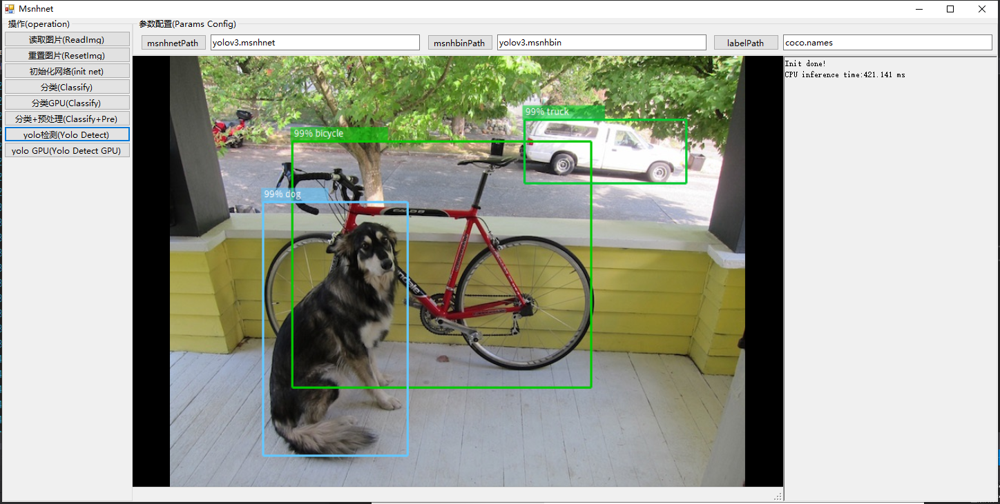

# Msnhnet(Yolov5已支持!!请下载最新的models)
[English](ReadMe.md)| 中文 |[CSDN](https://blog.csdn.net/MSNH2012/article/details/107216704)</br>
###  一款轻量的用于推理pytorch模型的框架,该框架受darknet启发.


</br>
</br>
**Ps:** <font color=#ff0000> 目前本框架在持续开发中，由于是业余时间开发，更新速度不会很快。也欢迎有志之士一块维护本框架. 欢迎三连</font>.

**目前测试过的操作系统** (你可以自己测试下mac os)
| |windows|linux|mac|
|:---:|:---:|:---:|:---:|
|checked||||
|gpu||||

**目前测试过的CPU** (其它U出现BUG可以在issue提出)
| |Intel i7|raspberry 3B|raspberry 4B|Jeston NX|
|:---:|:---:|:---:|:---:|:---:|
|checked|||||

**特点**
- 由纯c++编写完成, 不依赖其它第三方计算库, 同时也支持OpenBlas库.
- 支持目前主流的操作系统,Windows, linux(Ubuntu测试), mac os(未测试).
- 支持目前主流的cpu芯片, Intel X86,AMD(未测试) 和ARM.
- 支持x86结构avx2加速(持续优化中)。
- 支持arm结构neon加速(持续优化中)。
- 支持NNPack(主要为arm框架所用)。
- GPU cuda支持. (测试过的显卡 GTX1080Ti, Jetson NX)
- GPU cudnn支持. (测试过的显卡 GTX1080Ti, Jetson NX)
- GPU fp16支持.(测试过的显卡 GTX1080Ti, Jetson NX)
- **ps. 请检查你的显卡是否支持fp16双倍加速.**
- 该框架自带一套类似netron的可视化工具, 可在编写Msnhnet文件时清晰掌握网络结构.
- 支持keras转Msnhnet. (Keras 2 and tensorflow 1.x, 部分op)
- 支持pytorch一键转msnhnet(目前只支持部分Op, 持续更新中)。
- 支持c_api。
- 支持C#语言，[MsnhnetSharp](https://github.com/msnh2012/MsnhnetSharp)。

- 支持msnhnet可视化，类似netron。

- 持续开发中...(**也就晚上有时间... (╮（╯＿╰）╭)**)
  
**已测试的网络**
- lenet5
- lenet5_bn
- alexnet(**torchvision**)
- vgg16(**torchvision**)
- vgg16_bn(**torchvision**)
- resnet18(**torchvision**)
- resnet34(**torchvision**)
- resnet50(**torchvision**)
- resnet101(**torchvision**)
- resnet152(**torchvision**)
- darknet53[(Pytorch_Darknet53)](https://github.com/developer0hye/PyTorch-Darknet53)
- googLenet(**torchvision**)
- mobilenetv2(**torchvision**)
- yolov3[(u版yolov3)](https://github.com/ultralytics/yolov3)
- yolov3_spp[(u版yolov3)](https://github.com/ultralytics/yolov3)
- yolov3_tiny[(u版yolov3)](https://github.com/ultralytics/yolov3)
- yolov4[(u版yolov3)](https://github.com/ultralytics/yolov3)
- fcns[(pytorch-FCN-easiest-demo)](https://github.com/bat67/pytorch-FCN-easiest-demo)
- unet[(bbuf keras)](https://github.com/BBuf/Keras-Semantic-Segmentation)
- deeplabv3(**torchvision**)
- yolov5s[(U版yolov5,用于导出参数)](https://github.com/msnh2012/Yolov5ForMsnhnet)
- yolov5m[(U版yolov5,用于导出参数)](https://github.com/msnh2012/Yolov5ForMsnhnet)</br>
==============================================================
- mobilenetv2_yolov3_lite (cudnn分组卷积对Gtx10系列的Pascal显卡支持不好，请使用GPU模式)
- mobilenetv2_yolov3_nano (cudnn分组卷积对Gtx10系列的Pascal显卡支持不好，请使用GPU模式)
- yoloface100k (cudnn分组卷积对Gtx10系列的Pascal显卡支持不好，请使用GPU模式)
- yoloface500k (cudnn分组卷积对Gtx10系列的Pascal显卡支持不好，请使用GPU模式)
- 感谢qiuqiu的mobilenet yolo系列: https://github.com/dog-qiuqiu/MobileNetv2-YOLOV3
==============================================================
- **pretrained models** 链接：https://pan.baidu.com/s/1mBaJvGx7tp2ZsLKzT5ifOg 
提取码：x53z 

**Yolo测试** 
- Win10 MSVC 2017 I7-10700F (Linux平台大约比Win快10~20%,当然不是所有网络)

  |net|yolov3|yolov3_tiny|yolov4|
  |:---:|:---:|:---:|:---:|
  |time|380ms|50ms|432ms|

- ARM(Yolov3Tiny cpu)
  |cpu|raspberry 3B|raspberry 4B|Jeston NX|
  |:---:|:---:|:---:|:---:|
  |without NNPack|6s|2.5s|1.2s|
  |with NNPack|2.5s|1.1s|0.6s|
  |with neon asm|?|0.432s|?|

**Yolo GPU 测试**
- Ubuntu16.04  GCC  Cuda10.1  GTX1080Ti
  |net|yolov3|yolov3_tiny|yolov4|
  |:---:|:---:|:---:|:---:|
  |time|30ms|8ms|30ms|
  
- Jetson NX
  |net|yolov3|yolov3_tiny|yolov4|
  |:---:|:---:|:---:|:---:|
  |time|200ms|20ms|210ms|
  
**Yolo GPU cuDnn FP16 测试**
- Jetson NX
  |net|yolov3|yolov4|
  |:---:|:---:|:---:|
  |time|115ms|120ms|

**Mobilenet Yolo GPU cuDnn 测试**
- Jetson NX
  |net|yoloface100k|yoloface500k|mobilenetv2_yolov3_nano|mobilenetv2_yolov3_lite|
  |:---:|:---:|:---:|:---:|:---:|
  |time|7ms|20ms|20ms|30ms|

**DeepLabv3 GPU 测试**
- Ubuntu18.04  GCC  Cuda10.1  GTX2080Ti
  |net|deeplabv3_resnet101|deeplabv3_resnet50|
  |:---:|:---:|:---:|
  |time|22.51ms|16.46ms|

**依赖**
  * OpenCV4 [https://github.com/opencv/opencv](https://github.com/opencv/opencv)
  * yaml-cpp [https://github.com/jbeder/yaml-cpp](https://github.com/jbeder/yaml-cpp)
  * Qt5 (**可选**. 编译Msnhnet viewer时使用) [http://download.qt.io/archive/qt/](http://download.qt.io/archive/qt/)
  * Cuda10+, Cudnn7.0+

**视频教程(B站)**
- [如何在Linux上编译](https://www.bilibili.com/video/BV1ai4y1g7Nf)
- [如何在winows上编译](https://www.bilibili.com/video/BV1DD4y127VB)
- [Pytorch参数转msnhbin](https://www.bilibili.com/video/BV1rh41197L8)

**如何编译**
- CMake要求: CMake 3.10+
- 注意Viewer不能在GPU模式下编译
  
</br>
**ps. 你可以在CMakeLists.txt:52设置最大OMP占用线程, 默认是OMP使用所有CPU线程.(需取消勾选OMP_MAX_THREAD)** </br>

- **Windows平台编译(MSVC)**
    - 1.使用CMake编译安装OpenCV4和Yaml-cpp.
    - 2.在环境变量中添加"OpenCV_DIR"和"yaml-cpp_DIR"变量, 并设置变量内容为每个库的CMake目录.
    - 3.下载安装Qt5.
    - 4.把Qt5的bin目录添加环境变量Path.
    - 5.最后使用CMake GUI工具配置Msnhnet然后使用Visual Studio编译安装.

- **Linux(Ubuntu )**
   **注意: 构建NX的GPU版本取消勾选NNPACK NEON OPENBLAS.**
  ```
  sudo apt-get install qt5-default      #optional
  sudo apt-get install libqt5svg5-dev   #optional
  sudo apt-get install libopencv-dev

  # build yaml-cpp
  git clone https://github.com/jbeder/yaml-cpp.git
  cd yaml-cpp
  mkdir build 
  cd build 
  cmake .. -DYAML_BUILD_SHARED_LIBS=True -DYAML_CPP_BUILD_TESTS=False
  make -j4
  sudo make install 

  #config 
  sudo echo /usr/local/lib > /etc/ld.so.conf.d/usrlib.conf
  sudo ldconfig

  # build Msnhnet
  git clone https://github.com/msnh2012/Msnhnet.git
  mkdir build 
  
  cd Msnhnet/build
  cmake -DCMAKE_BUILD_TYPE=Release ..  
  make -j4
  sudo make install

  vim ~/.bashrc # Last line add: export PATH=/usr/local/bin:$PATH
  sudo ldconfig
  ```

**测试**
- 1.首先下载预训练模型并解压. eg.D:/models. 
- 2.打开终端或CMD, cd到安装目录. eg. D:/Msnhnet/bin
- 3.测试 yolov3 ```yolov3 D:/models```
- 4.测试 yolov3tiny_video ```yolov3tiny_video D:/models```
- 5.测试 classify ```classify D:/models```
</br>

**使用MsnhnetViewer查看网络结构**
- 1.打开终端或CMD, cd到安装目录 eg. D:/Msnhnet/bin
- 2.运行 "MsnhnetViewer"
</br>
- **Ps.** "ResBlock Res2Block AddBlock ConcatBlock"为网络层的封装, 你可以双击该块查看详细内容.

**各个封装的结构**
**ResBlock**</br>
</br>

**Res2Block**</br>
</br>

**AddBlock**</br>
</br>

**ConcatBlock**</br>
</br>

**如何转换模型**
- [pytorch2msnhnet](tools/pytorch2msnhnet/Readme.md)
- ps. 对于u版yolo不支持以该方式进行转换，需要先导出主干网络，再手动添加op.

**关于训练**
- 使用pytorch版本的各个模型训练即可,训练完成后,按照上一步,构建Msnhnet即可.
- 如yolov3/4. 使用U版: [https://github.com/ultralytics/yolov3](https://github.com/ultralytics/yolov3)

Enjoy it! :D

**感谢**

Msnhnet参考了以下框架:

- [DarkNet](https://github.com/pjreddie/darknet)
- [NCNN](https://github.com/Tencent/ncnn)
- [ACL](https://github.com/ARM-software/ComputeLibrary)

**加群交流**</br>
</br>

